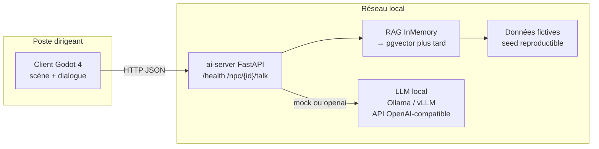

# Architecture GUILDE (M0)

## Vue d'ensemble

GUILDE est un **logiciel natif** : le client de jeu tourne sur le poste du dirigeant ; l'inférence IA tourne sur un serveur local (cible : ASUS Ascent GX10) joignable sur le réseau. Les données d'entreprise **ne quittent pas** le réseau local.

## Composants

| Composant | Rôle | Emplacement |
|-----------|------|-------------|
| Client Godot | Monde explorables, PNJ, panneau de dialogue | `client/` |
| ai-server | API PNJ, orchestration RAG + LLM | `ai-server/` |
| data | Générateur d'entreprise fictive | `data/` |
| LLM | Inférence locale (ou mock CI) | Config `LLM_*` |

## Modes LLM

- `LLM_MODE=mock` : réponses déterministes, sans GPU (CI / démo).
- `LLM_MODE=openai` : client HTTP vers `LLM_BASE_URL` + `LLM_MODEL` (Ollama, vLLM, etc.).

Les modèles cloud ne servent que de **référence de benchmark** sur données fictives (voir `docs/benchmark-plan.md`).

## Flux dialogue PNJ

1. Le joueur approche un PNJ et envoie un message.
2. `POST /npc/{id}/talk` récupère le profil PNJ.
3. RAG mémoire sélectionne des chunks (factures, échanges, parties).
4. Le LLM (mock ou réel) produit la réponse.
5. Le client affiche `reply` + métadonnées (`mode`, `sources`).

## Hors périmètre M0

Voix, génération d'images, simulation « et si j'embauche ? », persistance multi-entreprises, auth réseau.
